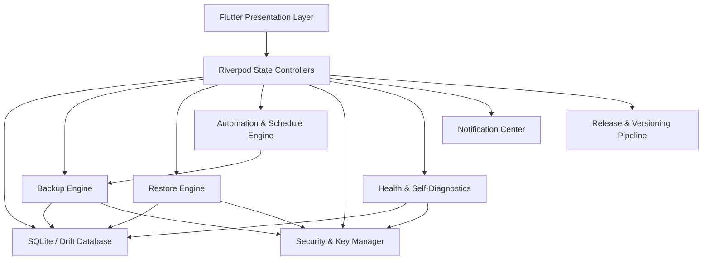

# BackupVault Architecture Design Document

This document outlines the system architecture, design decisions, and data flow of BackupVault, an enterprise-grade cross-platform backup automation utility built on Flutter.

---

## 1. System Overview

BackupVault is designed as a modular desktop and mobile utility that orchestrates periodic, real-time, and trigger-driven file copy-archive workflows. It features cryptographic security options, integrity verification, system diagnostics, and automated recovery handlers.

---

## 2. Core Modules

### 2.1 Database & Storage Layer (`lib/core/database/`)
- **Technology**: Built using SQLite with the `Drift` ORM generator.
- **Purpose**: Persists watched folder directories, metadata of backed-up files, schedules, security keys, notification settings, and execution logs.
- **Providers**: `databaseProvider` exposes the shared relational connection safely.

### 2.2 Backup Engine (`lib/core/services/`)
- **Technology**: Core dart file I/O operations with custom chunked copy buffers.
- **Key Features**:
  - Optional encryption via standard AES-256-GCM ciphers.
  - Multi-threaded file scanning and hashing (SHA-256) to ensure identity deduplication.
  - Integration with the watch system tray and real-time status observers.

### 2.3 Restore Engine (`lib/core/restore/`)
- **Key Features**:
  - Conflict resolution: supports original overwrite, renaming (unique sequence appending), and skipping.
  - Checksum validations post-restoration.
  - Direct search by filename query and folder status audits.

### 2.4 Backup Scheduler & Automation (`lib/features/scheduler/`)
- **Key Features**:
  - Run interval profiles: Immediate, Hourly, Daily, Weekly, Monthly, and custom Cron parser.
  - Watchdog triggers: Folders modification watcher, Windows startup/shutdown system hook, external USB/Drive attachment scanner.
  - Job queue serialization to ensure pending scheduler routines survive system restarts.

### 2.5 Security, Encryption & Integrity (`lib/features/security/`)
- **Key Features**:
  - Optional zero-knowledge encryption: users who choose not to encrypt can perform high-speed backups.
  - Key Generator (AES-256 standard) with backup export/import features.
  - Area Locks: restrict settings, configurations, and exports using hashed master password challenge barriers.
  - Database Protection: verifySQLite integrity checks and shadow backup recovery.

### 2.6 Diagnostics & Self-Healing (`lib/features/diagnostics/`)
- **Key Features**:
  - Continuous background health monitors: CPU, RAM, Disk I/O, Database latency.
  - Built-in disk benchmark test: measures real-time read and write rates using custom stress payloads.
  - Crash Detector: locks sessions via local storage trackers to report unexpected crash interruptions.
  - Self-Healing Validator: automatically reverts database states or resets corrupted file watchers.

### 2.7 Import / Export & Configuration Migration (`lib/features/configuration/`)
- **Key Features**:
  - Full system setting bundle export (JSON packaging with SHA-256 signatures).
  - Version upgrade migration engine: updates database schemas and injects new default configuration rules.

### 2.8 Release & Packaging Pipeline (`lib/features/release/`)
- **Key Features**:
  - Pre-build integration validator: verifies schema integrity and cryptographic capabilities.
  - Automated release notes compilation.
  - Windows installer script output tailored for Inno Setup compiler executions.

---

## 3. Data Flow

### 3.1 Backup Cycle Flow
1. **Trigger Event**: Scheduler fires, or watcher detects changes, or user clicks "Run Backup".
2. **Analysis**: Engine queries database for current folder rules and lists modified files.
3. **Encryption (Optional)**: If active, the file stream is passed through the `EncryptionManager` using AES-256-GCM.
4. **Writing**: The stream writes target bytes to the configured destination path.
5. **Registration**: Record entry is generated in the Drift SQLite database with its checksum.
6. **Notification**: Success payload completes and notifies the user via Windows Toast or tray balloon.
